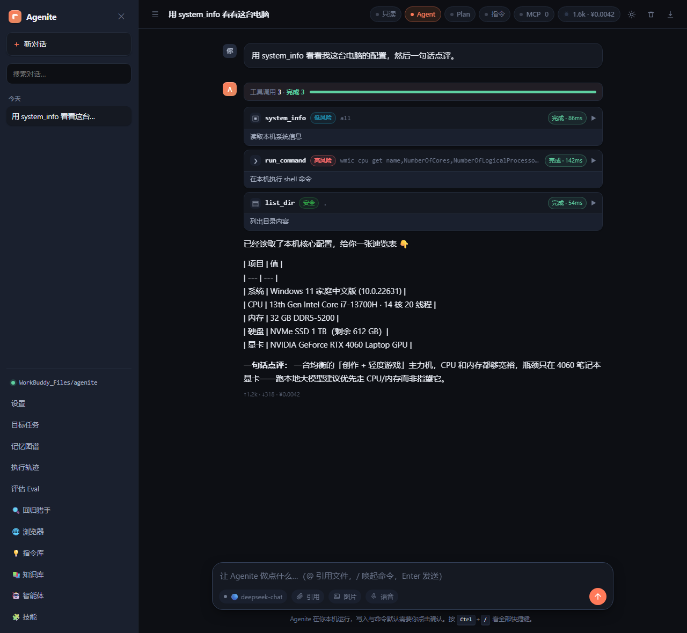
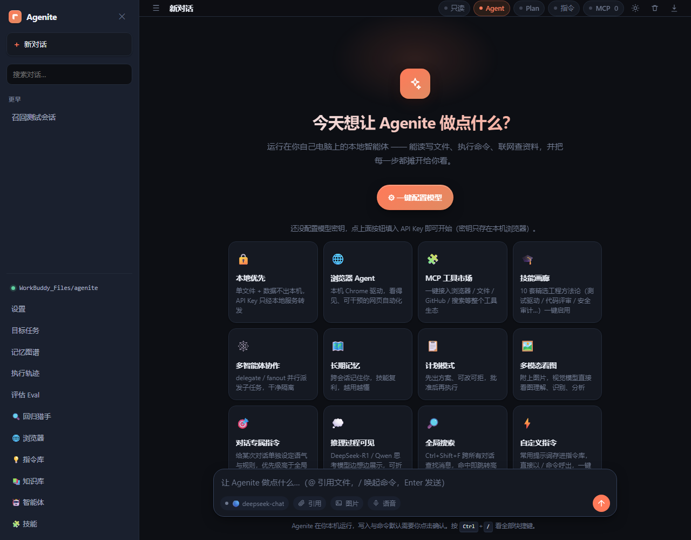
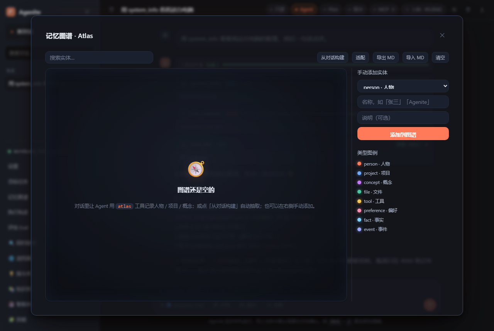
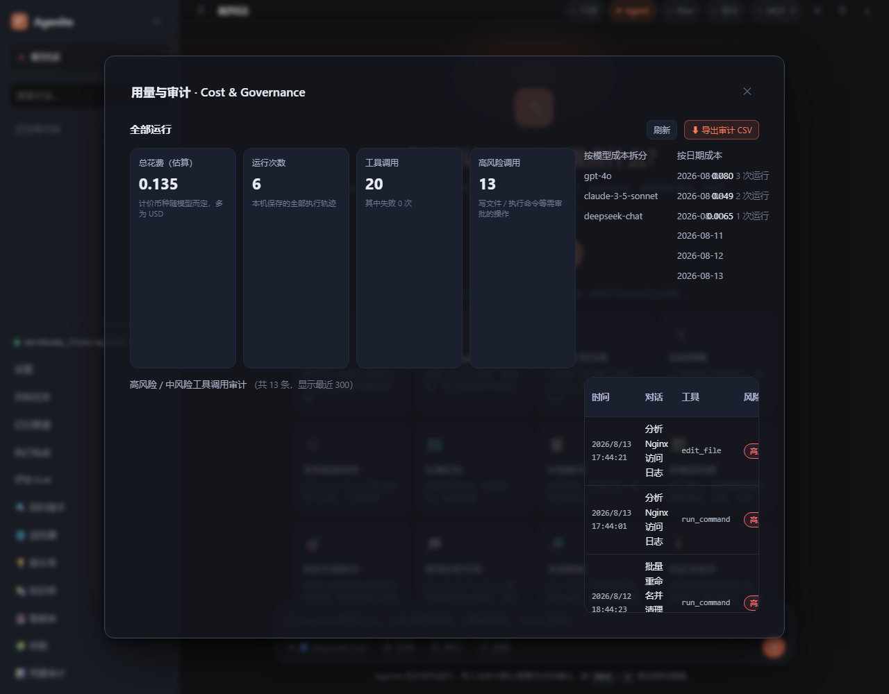
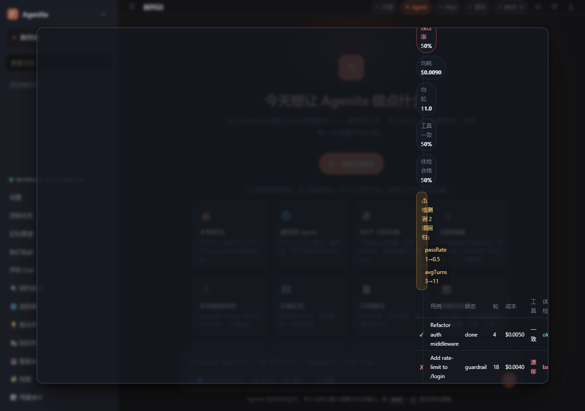
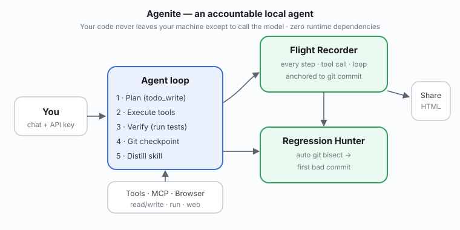

# Agenite 🤖

**本地优先的多模型智能体（Agent）客户端。** 填入你自己的模型 API Key，就能聊天；开启 Agent 后，它可以**联网查资料、读写本地文件、做计算、执行命令**，通过工具调用自主完成任务。

零依赖、纯离线、数据只存在你本地浏览器。对标 LobeChat / Open WebUI / LibreChat 这类热门项目，但更小巧、更透明、可直接审计每一行代码。

> 💡 因为要调用外部模型的 API（浏览器有跨域限制），Agenite 需要一个**本地小代理服务**来转发请求——这点和 LibreChat / Open WebUI 一样。本项目**零第三方依赖**，不用 `npm install`，只需 `node server.js` 打开浏览器即可。

---

<p align="center">
  <br>
  <i>Agenite 读取本机信息、执行 shell 命令，每一步都以带风险等级、可折叠的工具卡片摊开给你看。</i>
</p>

<p align="center">
  <br><br>
  <br>
  <i>首次欢迎页（上）与 Atlas 长期记忆图谱（下）。</i>
</p>

<p align="center">
  <br>
  <i>用量与审计中心：总花费、按模型成本拆分、按日期成本、以及中/高风险工具调用的可审计清单。</i>
</p>

<p align="center">
  <br>
  <i>评估与回归：选中保存的运行，冻结工具结果后重放，只换模型，标出通过率、成本、工具一致性的回归项。</i>
</p>

<div align="center">

**Agenite** —— 一个你敢把代码交给它的、本地优先的多模型智能体。

[](https://github.com/wangzifan396-wzf/agenite/actions)
[](LICENSE)
[](https://nodejs.org)
[](https://github.com/wangzifan396-wzf/agenite/stargazers)

</div>

## 为什么是 Agenite

大多数"AI 智能体"很自信，却不负责：它们改了你的文件，然后告诉你"搞定了"——哪怕其实坏了。Agenite 的设计核心是**可追责（accountability）**：

- **它证明自己真的做对了。** 每次改动后都会跑你真实的测试 / 校验命令，只有从**绿**的运行里才学出可复用的技能。
- **它绝不会弄丢你的代码。** 每次改动自动 `git` 检查点存档，一键 `git undo` 即可回退。
- **它把推理过程摊开给你看。** 内置飞行记录仪记录每一步、每次工具调用、每个循环，并把每条轨迹锚定到它运行时所在的 git 提交。
- **它会自我度量。** 内置 **Eval** 能把任意保存的运行变成「黄金回放」回归测试集：工具结果被原样冻结，模型是唯一变量，Agenite 会报告与上一次基线相比在通过率、成本、轮次、工具一致性上的回归。
- **出问题时，它能定位元凶。** 回归猎手自动驱动 `git bisect` 找出第一个引入问题的提交，再打开那个提交时期的执行轨迹，让你看见**bug 出现那一刻 Agent 究竟在干什么**。

零依赖、可纯离线、密钥除了调模型外从不出本机。对标 LobeChat / Open WebUI / LibreChat，但更小巧、更透明、可直接审计。

## 快速上手

```bash
# 无需 npm install —— 本项目零依赖
git clone https://github.com/wangzifan396-wzf/agenite.git
cd agenite
node server.js
# 打开 http://localhost:4173
```

或者一条 Docker 命令（数据存进卷，重启不丢）：

```bash
docker run -p 4173:4173 -v agenite-data:/root/.agenite ghcr.io/wangzifan396-wzf/agenite
```

在设置里填入模型 API Key（OpenAI / Anthropic / Gemini / DeepSeek / Qwen / Ollama / …），打开 **Agent** 开关，开聊即可。

## Agenite 与同类对比

| 能力 | Agenite | Open WebUI | LobeChat | LibreChat |
|---|---|---|---|---|
| 本地优先 · 零依赖 | ✓ | 部分 | 部分 | 部分 |
| 自主智能体循环（写码·执行·调工具） | ✓ | 部分 | 部分 | 部分 |
| 改完即校验（跑你的测试） | ✓ | — | — | — |
| 自动 git 检查点 + 回退 | ✓ | — | — | — |
| 飞行记录仪（每次运行轨迹） | ✓ | — | — | — |
| 回归猎手（自动 git bisect） | ✓ | — | — | — |
| 轨迹驱动的评估 / 回归测试集 | ✓ | — | — | — |
| 验证门控的技能学习 | ✓ | — | — | — |
| MCP 工具生态 | ✓ | ✓ | ✓ | 有限 |
| 多模型中枢（12+ 厂商） | ✓ | ✓ | ✓ | ✓ |
| 本地 RAG / 长期记忆 | ✓ | ✓ | — | — |
| 可分享配置预设（密钥永不导出） | ✓ | 部分 | — | — |

_实话实说：Agenite 还年轻——插件/主题生态和移动端比老牌项目薄弱。它用这份"薄弱"换来了让你可以放心把任务委托出去的可靠性底座。_

## 能力矩阵

浏览器自动化 · 文件与命令执行 · 代码执行器 · 联网搜索 · 多智能体并行派发 · 长期 + 语义记忆 · 本地 RAG · 计划模式 · 对话分支 · Token 与成本统计 · 技能画廊 · 语音朗读 · 多模态看图 · 跨对话搜索 · 轨迹驱动的评估 / 回归测试集 · 可分享配置预设 · 自进化经验闭环（从真实轨迹复利最佳配置 + 配置漂移哨兵） · 韧性内核（瞬时失败重试 + 卡死循环熔断） · 元认知反思 · 经验手册（运行反思提炼 + 注入后续对话系统提示）。

---

## 工作原理

<p align="center">
  
</p>

---

## ✨ 功能

- **可信经验记忆 · 越用越聪明而不中毒（v0.60.0）**：对 2026 年「和你一起成长的 Agent」浪潮给出的可信答案。Hermes 证明了记忆能跨会话复利增值——但它众所周知的软肋是*会静默记住自己的失败*；DeepSeek Harness 则证明了真正值钱的是*可组合运行时 + 干净的扩展接缝*，而非模型本身。v0.60 把二者与 Agenite 已有的 v0.58 验证门控 + v0.59 成果复核焊在一起，让记忆**绝不**被污染：**只有同时通过两道闸门的目标**（真实证据证明确实做完 + 对真实 diff 做质量复核）才会被结晶成经验。每个目标启动时，Agent 会按轻量的 token 重叠度召回 top-k 条历史已验证经验，注入系统提示当作「以前奏效的做法」；当一个经过验证的目标成功完成时，再以原子追加的方式沉淀一条新经验（落在 `memory/experiences/experiences.jsonl`）。它复用了同一套 VERIFY→自愈循环，以及 v0.57 可插拔运行时那套「可注入接缝」纪律——**`agent.js` / `tools.js` / `server.js` 热路径零改动，ACI 零新增**。开关 `goalMemory: on`（默认）/ `off`；界面上每个目标多出一枚 **经验复用 ×N / 已沉淀经验** 徽章。

- **多模型智能路由 · 规划用强模型、执行用便宜模型（v0.62.0）**：把 2026 年「多模型管理 + 智能路由」浪潮里最经得起验证的一条结论落了地——**架构级分层路由（planner-executor split）**，而非逐次 prompt 分类。目标被拆成**推理层**（规划 / 验证门控 / 成果复核 / 技能蒸馏，喂强模型）与**执行层**（自治工具循环 + 最终总结，喂便宜模型），典型构建成本直降约 4×、内层循环延迟更低。检索反复强调的一个硬约束被我们当成了护栏：**便宜模型的关键失败是漏参数、输出畸形工具调用 JSON**——所以两道闸门（v0.58 验证 + v0.59 复核）**始终跑在强模型上、读取的是执行日志的事实**，便宜 executor 无法把错误结果「看起来对」地蒙混过关（这正是 2026 共识里"静默退化"的结构性防御）。实现上 **`client.js` 热路径零改动**：`callModelStream` 本就支持 `config.model` 覆盖，`modelRouter.js` 只做纯函数路由 + 全依赖可注入，`goals.js` 局部用 `cmR`/`cmE` 包装 `cm` 即可。设置里「⚙ 模型」新增**多模型智能路由**总开关与**推理模型 / 执行模型**两个输入框（均可留空回退到默认模型），每个目标卡片多出一枚 **多模型路由 · 推理 X / 执行 Y**（或 **单模型 · X**）徽章。
- **程序性技能结晶 · Agent 自己写作战手册（v0.61.0）**：在 v0.60 已验证*经验*池之上的下一层——也就是 Hermes 最具辨识度的**程序性记忆**。经验存的是「这次目标奏效了什么」的原始叙事，而技能存的是被**蒸馏、可复用**的做法（适用场景 / 步骤 / 已知失败点 / 验证步骤），能套用到未来一*整类*目标上。当一个**复杂**目标同时通过 v0.58 验证门控与 v0.59 成果复核时，Agent 会借模型把这次做法蒸馏成结构化技能并结晶（`memory/skills/<id>.md` + `index.json`）；未来同类目标启动时，会召回匹配的已有技能、把其完整正文注入系统提示。这是**分级渐进加载**：索引只存名称+摘要（极省 token），只有命中分数最高的前 k 个技能的*正文*才会被加载——技能库越大，token 成本依旧平稳。后续更优的一次运行会**精炼**已有技能而非重复新建。同一道「绝不中毒」护栏依然生效：只有「复杂 + 双闸门通过」的目标才会成为技能，于是作战手册永远不会把错误编码进去。开关 `skillCrystallization: on`（默认）/ `off`；界面上每个目标多出一枚 **技能复用 ×N / 已结晶技能** 徽章。

- **自进化 · 经验复利（v0.54.0）**：Agenite 已经会记录每次运行（轨迹）、度量每次运行（评估）、并分享调好的配置（预设）——但这三件仪器尚未**闭环**。新增侧栏 **🧬 自进化** 面板：给出真实运行的**健康度排行榜**（按错误数、成本、轮次、静默空转打分，列出最好/最差）、**从真实轨迹蒸馏最佳配置**（挑出健康度最高的厂商/模型，冻结成可一键套用的预设——永不导出你的 API Key 与工作目录）、并跑一个**漂移哨兵**——当前配置比某次历史运行用过的配置评分更低时自动告警，配合一键**回滚到任意经验快照**。这正是 2026 年「越用越聪明的 Agent」（Hermes、OpenJarvis）承诺、却只靠启发式糊弄的事，我们落在 verify + eval 的硬信号上：Agent 越用越准，且绝不静默变差。

- **元认知反思 · 经验手册（v0.56.0）**：自进化叙事里 *行为层* 的那一半，叠在 v0.54 *配置层* 自进化之上。每一次运行结束时都会跑一次反思：把这次运行的硬信号——自动验证是否通过、是否卡死循环、变更后是否缺验证、是否跑完——提炼成**带类型的经验**（原则 / 流程 / 警示 / 技能缺陷 / 执行失误），打分后持久化到 `~/.agenite/memory/lessons.json`。评分最高的经验会被**注入下一轮运行的系统提示**，于是 Agent 真的是"越用越会干活"；侧栏 **📖 经验手册** 面板可浏览、启停、删除、清空，切换注入开关，并选择是否让模型把模板经验细化成更具体的条目。这正是 2026 年元认知反思浪潮（MARS / EmbodiSkill）落在本机、且完全基于 Agenite 已有的硬信号——不猜、不上云、纯离线。
- **可插拔运行时 · 前置经验护栏与项目指令文件（v0.57.0）**：从爆火的 DeepSeek Harness 借来的「引擎级」能力——它真正值钱的是**架构**而非模型。Agenite 现在多了一个轻量 **HookBus + 工具执行管线（前/后处理阶段）**（`src/core/hooks.js`），成为每次工具调用都会流经的唯一可插拔接缝。两个现成插件挂在上面：**① 前置经验护栏**把 v0.56 的「经验手册」从被动塞进系统提示的脚注，升级成**主动**安全闸门——在任何会改动世界的工具执行前，它先召回 Agent 自己用真金白银换来的经验（变更后未验证、验证失败、死循环空转），在 `warn` 模式（默认）下以**实时 UI 提示 + 折叠进工具结果**的方式让模型在上下文里看到这条经验；在 `block` 模式下，仅当存在强置信度的「死循环」经验时，才拦截风险最高的几个动词。**② 项目指令文件（兼容 AGENTS.md / CLAUDE.md）**会自动把仓库里的「本仓库怎么协作」文件载入系统提示，约定从此自动被遵守，不用每轮重复粘贴。**两者都是加法**：`agent.js` / `tools.js` 的热路径原封未动——零回归（489 项测试全绿）。

- **验证门控的目标完成判据（v0.58.0）**：一个 Agent「只是试着做」与「你敢托付」之间最大的鸿沟——*它怎么知道自己做完了？* 此前，被委派的目标会让 LLM 去给**它自己的报告**打分，并把任何没有字面写"未完成"的结果当成完成——这正是 2026 年可靠性复盘里点名的**假阳性偏置**。v0.58 把它翻转为**证据优先**。目标完成现在是一道**验证门控**：**确定性真测试验证是主信号**——自动探测并运行项目自己的校验（`npm test` / `cargo test` / `go test` / `pytest` / `make test`），命令通过才算完成；**全新上下文的 LLM 验收员**作为兜底（只看*执行日志事实*，看不到 Agent 的自报结论，因此无法给自己的主张盖橡皮章），专门用于没有测试命令的开放式目标。偏置被彻底反转：**无证据 ⇒ 未完成**，且最终报告会携带证据（跑了哪条命令、它说了什么）。通过 `goalVerify` 提供四种模式：`auto`（有测试就跑测试、否则用验收员，默认）、`full`（只用测试门控；若没探测到测试，目标直接*判失败*而非静默通过）、`judge`（只用全新上下文验收员）、`off`（旧行为，不推荐）。纯加法——`agent.js` / `tools.js` / `server.js` 热路径零改动；Agent 自家验证循环已在用的 `verifyWorkspace`，现在成了目标完成的权威真相源。

- **成果复核门控 · 防作弊（v0.59.0）**：v0.58 证明了目标「跑通了测试」——但 2026 年的硬教训是**「测试通过 ≠ 补丁好」**。METR 发现 SWE-bench Verified 里只有约 50% 的补丁被维护者真正合并；OpenAI 在 2026-02 因测试污染问题弃用 SWE-bench Verified；Anthropic 的「Outcomes」把静默失败率砍到约 1/6。于是 v0.59 把**质量闸门焊进同一道 VERIFY→自愈循环**——不引入第二个 Agent，也不加重 ACI（这正是 Princeton mini-SWE-agent 的结论：智能体-计算机接口比架构更重要）。在确定性测试门已经证明目标*功能上*做完之后，**成果复核门控**才登场：**① 确定性防作弊检查**（常开、免费）——直接驳回空 diff / no-op，以及删除测试文件这类 Berkeley RDI 扫描器点名的作弊套路；**② 全新上下文的「质量评审员」**——只看*真实 git diff + 验证结果*，绝不看 Agent 自报结论，返回结构化批评（「达标 / 未达标」+ 具体修改建议）。一旦判「未达标」，这条具体意见会被**直接喂回自愈循环**，于是 Agent 修的是真正的质量缺口，而不只是把测试跑绿。通过 `goalCritic` 开关：`on`（默认）或 `off`。优雅降级——拿不到 git 基线做 diff 时，闸门自动跳过，v0.58 的验证门控依旧是权威真相源。界面上每个目标多了一枚 **成果复核** 徽章。

- **韧性内核（v0.55.0）**：针对核心循环的两个真实痛点修复，主线始终在 *agent 本身*。**瞬时失败重试**——以往模型调用（429 / 5xx / 网络抖动）第一次出错就抛异常、整段多轮运行直接中断；现在 `client.js` 最多重试 3 次（指数退避 + 抖动，硬鉴权 4xx 不重试、用户取消的 `AbortError` 不重试），并抛出带类型的 `ModelCallError`。**卡死循环熔断**——`trace.js` 早就能*检测*完全相同的工具调用死循环，但 Agent 从未*动作*；现在 `agent.js` 在模型连续 3 轮重复同一组工具调用时（与顺序无关，复用 `maxReflections` 预算）注入一次有上限的自检反思，强制换思路而非空转到底。Agent 现在既能扛住上游噪声，也能管住自己的最坏习惯。

- **可分享的 Agent 配置预设（v0.53.0）**：补上「把我这套 Agent 怎么配的分享给你」这条分发渠道。侧栏 **🎚️ 预设** 面板可以把当前 Agent 配置——模型、工具、技能、记忆、系统提示、运行模式、安全闸门——冻结成一个可移植预设：能**导出为 JSON、从别人那里导入、或一键克隆 3 个内置示例**（通用助手 / 代码工程师 / 只读研究助手）。铁律是：预设**永不导出你的 API Key，也永不导出你的本地工作目录**——套用别人的预设永远偷不走你的密钥、也搬不动你的沙箱，你的密钥与路径始终保留在本机。这正是 adoption 的杠杆：像分享一份 `.gitignore` 那样分享一个调好的 Agent，社区开始复利配置、而不是各自重新发明。

- **轨迹驱动的评估与回归（v0.52.0）**：Agenite 已经把所有运行存为轨迹。现在内置的 **评估（Eval）** 面板把这些真实运行变成一套本地、确定性的回归测试集。选中保存的轨迹，在**冻结工具结果**的前提下用某个模型重放（模型是唯一变量），即可得到一份 CLASS 风格报告：通过率、成本、轮次、工具一致性与自检结论。下一次运行会自动与上一次基线对比，提前标出回归项。无需合成 benchmark、无需云上 harness、无需额外工具。这是区分「一次能跑」和「一直能跑」的关键可观测层。

- **商业级用量与审计中心（v0.51.0）**：为团队而生的可追责看板。新增 **📊 用量与审计** 面板，聚合所有保存运行的总花费、运行次数、工具调用数、高风险调用数，并按模型 / 按日期拆分成本，列出每一次中 / 高风险工具调用的可审计清单，支持一键导出 CSV 合规留痕。直接回答 CTO 把 Agent 放进生产流程前必须问的两个问题：*它花了多少钱？* 以及 *它执行过哪些高风险操作？*

- **真实产品截图（v0.50.0）**：README 不再用手绘占位图，而是放上 Agenite 真实运行 Agent 任务的 UI 截图——带风险等级的工具卡片、首次欢迎页、Atlas 长期记忆图谱、以及新增的用量与审计看板。图片存于 `docs/screenshots/`，用 `puppeteer-core` 驱动真实应用生成，随着界面迭代可同步更新。

- **成熟度与"让人愿意用"发布（v0.49.0）**：agent 功能已完整，本版聚焦**好用、好分享**。新增亮点：**可分享的运行报告**——打开任意执行轨迹（实时或回放），一键导出成自包含 HTML 文件，可直接发给同事或贴出来；**一键 Docker 镜像**（`docker run -p 4173:4173 -v agenite-data:/root/.agenite ghcr.io/wangzifan396-wzf/agenite`）；**CI 工作流**在 Node 18/20/22 上跑全量测试（绿徽章）；重写的落地 README 含与 Open WebUI / LobeChat / LibreChat 的对比表。首次使用也加了"3 步上手"提示与示例任务。

- **飞行记录仪 ↔ git 提交联动（v0.48.0）**：把 v0.17.0 的「执行轨迹」从"能看"变成"能用来排障"。每条 trace 现在都会**锚定到它运行时所在的 git 提交**——运行开始记 `gitStart`、结束记 `gitEnd`（自动检查点可能在运行中又提交了，所以两端都记），于是每条轨迹都精确知道归属于哪个提交。这和 v0.47.0 的「回归猎手」形成闭环：一旦 `regression_hunt` 定位出坏提交，结果面板就多一个一键 **🛰️ 查看该提交时期的执行轨迹** 按钮，直接拉起按该提交过滤的执行轨迹回放（`GET /api/traces?gitRef=<hash>`）——让你看到**那个 bug 被引入的瞬间，Agent 到底在干什么：它的推理、它的工具调用、它那次静默的死循环**，而不只是对着 diff 猜。匹配是纯函数、零依赖的 `matchGitRef`：完整哈希 / 短哈希 / 任意前缀都能双向解析，64 位 SHA-256 与 7 位短哈希都能正确命中。

- **回归猎手 — 自动 `git bisect` 定位坏提交（v0.47.0）**：补上"以前好好的、现在坏了"这块拼图。当用户说"之前还好好的 / 什么时候开始出问题的 / 某次更新后功能挂了"，Agent 调用 `regression_hunt`，**自动驱动 git bisect**，用项目自己的校验命令（自动探测 `npm test` / `pytest` / `go test` / 自定义命令）逐个提交测试，精准定位**第一个引入问题的提交**——不用再手动 checkout 一个个试：
  - 🔍 **自己驱动二分循环（而非 `git bisect run`）**：我们亲自驱动二分，因为 `git bisect run` 要自己 exec 命令，在 Windows 上会因 `npm/yarn` 是 `.cmd` 包装壳而挂掉，而且它只能从 locale 相关的「`<hash> is the first bad commit`」文案里读坏提交。我们改为从 `refs/bisect/*` 引用集合读答案——**与语言无关**，在 **SHA-256 仓库**（64 位哈希）上同样可用。
  - 🛡️ **两端预检防假阳性**：先验证 HEAD 当前确实失败（否则报 `head-pass`），再验证选中的好基准确实通过（否则报 `good-bad`——你的基准本身就坏了，得回退更远），最后才信任「good」标记——绝不会返回一个错的 culprit。
  - ♻️ **始终还原工作树**：每条退出路径（成功 / 失败 / 异常）都会跑 `git bisect reset`，必要时把原分支 checkout 回来，绝不会把用户留在 detached HEAD。
  - 🖥️ **UI 面板 + 后台轮询**：侧栏「🔍 回归猎手」打开面板，自动预检工作区、建议好基准（最近的 tag，或回退 N 个提交）；开始后由后端逐提交跑测试（分钟级），前端实时轮询渲染每一轮（good/bad/skip）与最终 culprit（哈希 / 提交说明 / 作者 / 日期 / 受影响文件 / 搜索范围）。一键「让智能体分析这个提交」直接把该提交交给 Agent 去修。
  - 🔒 **子代理与并行安全**：因为 `regression_hunt` 会切换工作树，它被列入子代理禁用集与「永不压缩」集——子代理无法并行跑它去抢文件，二分结果也绝不会被无声丢弃。

- **验证门控的技能自蒸馏（v0.46.0）**：技能库从"会自动变多"升级成"会自动变好"。多数自我进化的 Agent 靠**模型自评**判断"这次算成功吗"——这是最不可靠的信号；Agenite 每一轮本来就在产出**客观证据**（v0.44 的真实验证命令、v0.43 的真实 git 检查点），于是我们直接拿证据当闸门：
  - 🚦 **红灯不沉淀**：本轮自动验证失败，就**绝不**把这套工作流固化成技能——闸门跑在模型调用之前，连一次反思请求都不浪费。验证通过的技能盖上 **✓已验证** 徽标，在系统提示词里优先采信。
  - ⚠️ **反模式（借鉴 SEED 的"后见技能"）**：通往成功路上的每一次验证失败、每一条自愈提醒、每一个工具报错都被挖成显式的「不要这样做」清单，随技能一起存盘、一起被读回。成功路径告诉你怎么做，反模式告诉你**别怎么做**。
  - 🧬 **版本取代而非覆盖**：同名技能被重新学会时版本 +1，旧版本原样归档为 `<slug>.v1.md`（`status: superseded`），随时可回退审计，而不是被无声抹掉。
  - 📉 **评分与裁剪**：每次 `skill_recall` 都记一次使用；用拉普拉斯平滑算成功率，用够 3 次仍低于 0.4 的技能会被**归档**（文件保留在磁盘）。这一条来自 MindMemOS 的教训——**未经修剪的技能库比没有技能库还差**，过期与冗余技能是纯噪声。技能画廊里一键「🧹 裁剪低分技能」。
  - 🔎 **渐进式披露**：系统提示词只放 名称 + 描述 + 证据徽标（版本 / ✓已验证 / 使用次数·评分 / 反模式条数），按评分排序，已归档与已取代的版本**不进提示词**；完整正文仍由 `skill_recall` 按需取回。
- **上下文经济层（v0.45.0）**：工具结果在**进入对话历史之前**就被按内容类型压缩——而不是等到整个窗口已经溢出才粗暴截断（那种"事后压缩"仍作为安全网保留）。超大输出被压缩的同时，**每一个字节都保持可取回**：
  - 🗜️ **内容感知、三种形态**：巨型 JSON 收成**结构骨架 + 样本 + 异常元素**（`Array(1247) of {id: number, …}`——混在一千条正常数据里的那一条错误行会被原样保留）；日志洪流把重复行折叠成 `×N`；源码文件变成**声明轮廓 + 你的 `query` 真正命中的那几行上下文**。
  - ♻️ **天然可逆**：原文完整存入带 TTL 的 `ContextStore`，压缩文本末尾附 `context_retrieve(handle="…")` 句柄。模型按需取回精确行（可加 `pattern` 做正则筛选），而不是重跑原工具。**没有 store 就绝不压缩**，因此绝不会无声丢信息。
  - 🎚️ **三种模式**：`off` / `smart`（默认，只压真正超大的）/ `aggressive`（小窗口更早更狠）。阈值可在 ⚙ 工作区 / 权限中调整。失败结果和短小结构工具（`todo_write` / `plan` / `verify` / `git`）永不被压缩。
- **改完即验证闭环（v0.44.0）**：补齐可靠 harness 的第四块拼图——**规划**（`todo_write`）→ **执行**（工具）→ **验证** → **回退**（git 自愈）形成完整闭环。凡是改动过文件的回合结束后，harness 会**自动验证改动**，让 Agent 再也无法"自信地交出一坨坏代码"：
  - ⚡ **零配置语法快检（默认 `syntax`）**：只对本回合**改动过的文件**跑 `node --check` / `JSON.parse` / `py_compile`——亚秒级、永不执行项目代码，全员默认开启也安全。
  - 🧪 **完整测试（`full`）**：自动探测项目的真实测试命令（`npm/pnpm/yarn/bun test` → `cargo test` → `go test` → `pytest` → `make test`），跳过 npm 占位脚本并执行；探测不到命令时优雅降级为语法快检，而非硬失败。
  - 📉 **有界自愈**：验证失败时，循环把**压缩后的失败清单**（内置 TAP/jest/vitest/pytest/go/cargo/tsc/eslint 结构化解析）喂回模型让其修复，受 `maxVerifyFixes`（默认 2）上限约束；触顶后停止并提示用户用 `git undo` 回退。
  - 🔧 **`verify` 工具 + 自动验证钩子**：Agent 也可主动调用 `verify` 自证改动真的能跑（杜绝"嘴上说好了"）；系统提示词新增提醒：没验证完不许说"完成"。
  - ⚙️ 可在「⚙ 工作区 / 权限」中配置：自动验证级别 `off / syntax / full`，以及可选的自定义 `verifyCmd`。
- **多模型 / 多运营商（v0.25.0 升级为「模型中枢」）**：内置 **12 家**供应商预设与可一键选取的模型目录——OpenAI、Anthropic (Claude)、Google Gemini、DeepSeek、硅基流动 (SiliconFlow)、通义千问 (Qwen)、Kimi (Moonshot)、智谱 (GLM)、Groq、Ollama（本地）、OpenRouter，以及任意 OpenAI 兼容接口。切换供应商会自动带出对应的 baseURL 与默认模型、上下文窗口徽标，对标 Cherry Studio 的「多模型聚合」。
- **MCP 工具生态（v0.5.0 新增）**：内置 **MCP（Model Context Protocol）客户端**，通过 stdio 连接任意 MCP 服务器，把整个开源工具生态变成模型可调用的工具——**浏览器自动化、桌面/电脑控制、数据库、GitHub** 等等。设置里点一下即可接入：
  - 🌐 **浏览器控制** — Playwright MCP（`npx -y @playwright/mcp@latest`）
  - 🖥️ **桌面控制** — windows-computer-use-mcp（点击、键入、截屏）
  - ✋ **桌面 + 浏览器** — ScreenHand
  - 也可手动填 `command` / `args` / `env` 接入任意服务器；MCP 工具名以 `mcp__服务器__工具` 形式出现，**同样走审批门控**。
  - 🔌 **远程 MCP（v0.6.0 新增）**：除了本地 stdio，还支持 **HTTP（Streamable HTTP）** 与 **SSE** 两种远程传输，直接连托管在云端的工具服务器；并能**一键导入 Claude Desktop / Cursor / Cherry Studio 的 `mcp.json`**（粘贴或选文件即可），不用逐条手抄。
  - 🔓 **只读工具免审（v0.6.0）**：名称命中 `get_` / `list_` / `search_` / `read_` 等只读动词的 MCP 工具，可设为自动放行、不再逐次弹窗；写入类工具仍然走审批。设置里「⚙ 工作区 / 权限」可加 **工具白名单**（点「始终允许」即永久免审，可随时移除）。
- **上下文自动压缩（v0.6.0）**：长对话逼近模型上下文窗口时，服务端正文**自动压缩**——先裁剪最旧的工具输出，再归纳丢弃最早的几轮对话并注入摘要，避免「对话越长越傻」或突然 400。压缩发生时界面会给出提示，而非悄悄丢上下文。
- **成本 & Token 统计（v0.6.0）**：顶栏实时显示**上下文占用环 + 累计 token（输入/输出）+ 预估花费**（按内置价格表估算，本地模型算 0，未知单价则只统计 token）；每条助手回复下也显示本次消耗的 token 与轮数。价格表可在「⚙ 高级」里按你的实际账单覆盖。
- **最大轮次可配 + 续跑（v0.6.0）**：Agent 循环上限 `maxTurns` 默认 20、可在「⚙ 高级」里设 1–100；任务没跑完只是因为撞到上限时，助手消息下方出现 **▶ 继续执行** 按钮，点一下就从上次断点继续，不用重头再来。
- **长期记忆（v0.7.0）**：Agenite 现在会**跨会话记住你**——把关于你的偏好、项目与决策写进本机 `~/.agenite/memory/MEMORY.md`（外加每日日志），每次对话开始时自动注入系统提示词；并配套 `memory_recall`（检索）、`memory_save`（保存事实）、`memory_log`（记今日）三个工具，让模型能主动积累与复用知识。可在「⚙ 工作区 / 权限」关闭。
- **本地模型 Ollama（v0.7.0）**：选 Ollama 提供方即可跑**完全本地、零成本、数据不出本机**的模型。设置里点「🔄 刷新本地模型」会自动列出你已 `ollama pull` 的模型，API Key 可留空。
- **联网搜索 web_search（v0.7.0）**：新增免 key 的 `web_search` 工具（DuckDuckGo），让 Agent 能**主动上网调研**——查文档、查新闻、核实事实都不再需要先让你贴链接。
- **子代理委派 delegate（v0.8.0）**：这是从"单循环助手"迈向"真·智能体"的关键一跳。主 Agent 可以用 `delegate` 派发一个**隔离上下文**的子代理去完成聚焦的子任务（如"调研 X"、"审查失败测试"），子代理独立跑自己的工具循环，只把**最终摘要**回传主对话——主线程不会被中间过程刷屏，也能把互不依赖的任务并行拆给多个子代理。子代理**不嵌套**、按 `tool_scope` 最小权限、可指定 `persona` 专业化。前端会把子代理的每一步渲染成可折叠卡片。
- **自进化技能库（v0.8.0）**：借鉴 Hermes / GenericAgent 的"技能复利"——Agent 把跑通的复杂工作流**沉淀成可复用的本地技能文件**（`skills/*.md`，SKILL.md 风格 frontmatter），后续会话自动把技能目录注入系统提示词；要用时 `skill_recall` 读取完整步骤。越用越聪明，且每个技能都是你能读能改的纯本地文件。
- **语义记忆（v0.8.0）**：当提供方是本地 Ollama 时，`memory_recall` 会调用本机 `nomic-embed-text` 做**向量语义检索**（完全离线、零成本），无嵌入模型时自动回退关键词。
- **并行多智能体委派 fanout（v0.9.0）**：把 v0.8.0 的串行 `delegate` 升级为**一次性并行派发多个隔离子代理**。当一条请求能拆成若干互不依赖的子任务（分头调研多个角度、并行处理多个文件批次、同时排查若干独立问题）时，用 `fanout` 一次性并发跑 N 个独立上下文的子循环，**一次拿回全部摘要**——比反复串行 `delegate` 快得多。每个子代理仍是隔离上下文、不嵌套、可按 `tool_scope` 最小权限；单个子代理失败不会拖垮其他（失败隔离）。所有子代理通过 `subagent` SSE 流式回传，前端同时渲染多张并行卡片。最多 8 个并行；有依赖的子任务请改用串行 `delegate`。
- **工作区语义检索 codebase_search（v0.10.0）**：新增**完全本地、代码不出机器**的语义+关键词代码检索。问"X 在哪里实现的"、"找做 Y 的代码"时，Agent 会扫描整个工作区（自动跳过 node_modules/.git/dist 等），先按 CJK 感知关键词排名，若本机有 Ollama 嵌入模型（`nomic-embed-text`）再用向量余弦**重排**得到更准的语义结果（无嵌入模型时自动回退关键词）。大仓库会截取前若干个文件建索引并明示。
- **技能自动沉淀（v0.10.0）**：把 v0.8.0 的手工 `save_skill` 升级成**真正自进化**——任务跑完、且确实够复杂（工具调用 ≥3 或用了 ≥2 种工具）时，Agent 会**自动**用一次 tool-free 反思，判断本次工作流是否值得固化成可复用技能；值得就直接写成 `skills/*.md`，下次会话自动进入技能库（前端弹出"💡 自动沉淀技能"提示）。设置里可开/关。任何失败都静默跳过，绝不打断对话。
- **本地代码解释器 run_code（v0.11.0）**：把 Agent 从"给建议"升级成"真正动手算 / 跑 / 验证"。在工作区沙箱里**执行一段代码**并取回输出——适合算数、数据处理、验证算法、生成文件、解析日志。支持 `language="node"`（本机 Node，零依赖直接可用）与 `language="python"`（自动探测 python3/python）。超时 30s，捕获 stdout/stderr/退出码；执行报错不崩溃，把报错原样回传让模型自行修正。需开启「电脑操作权限」并审批。
- **角色人格库 persona（v0.11.0）**：一键切换 Agent 的说话与思维方式——内置 `default` / `strict-reviewer`（严厉代码审查员）/ `warm-writer`（温柔写作助手）/ `researcher`（严谨研究员），也能把当前「系统提示词」**另存为自定义角色**反复复用（存于 `~/.agenite/memory/personas/`）。人格注入系统提示词，并可下发给子代理，是整个"自进化"叙事里的创意支点。
- **自治目标委派 + 自验证 · 任务看板（v0.12.0）**：这是把 Agenite 从"陪你写代码的聊天 Agent"升级成"**你能交办整个目标、它自治执行并自验证、你随时回来验收**"的关键一跃，直接对齐 OpenHands / Hermes / Codex 后台 Agent 的"交办即走"范式。在侧栏「目标任务」里派发一个目标（如"给 server.js 加速率限制中间件并补测试"），Agent 会**独立**完成：① 规划 → ② 自治执行（复用全部内置工具，含 `run_code` 跑测试、`codebase_search` 找代码、`fanout` 并行子代理，沙箱内操作**自动批准**、不需逐步确认）→ ③ **自验证**（强制跑测试/构建/lint，不过验证不宣布完成）→ ④ 写报告。全过程**持久化**到 `~/.agenite/memory/goals/`，刷新浏览器或重启服务都不丢；看板实时显示计划、进度日志、花费与最终报告，可一键停止。最多同时跑 3 个。这是咱们补齐"竞争力落差"的主线能力。
- **目标护栏 + 自愈重试（v0.13.0）**：让"交办即走"真正**可靠**、不会跑飞。每个目标现在带**三层预算护栏**（步数上限 / 成本上限 $ / 时长上限，均有安全默认值，派发表单里可调）→ 任一触顶立即停并标记失败；更关键的是**自愈重试**——自验证判定"未完成 / 部分完成"时，Agent 会拿到自己的验收结论，**自动复盘、修正、重新跑验证**，直到通过或达重试上限（默认 2 次），步数与成本在多次尝试间**累加计入预算**。这正是对标 OpenHands / Hermes"自治且可控"的核心体验：你敢把更大的目标交给它，因为它既会自己修自己的失败，又绝不会无上限地烧钱烧时间。
- **Agenite Atlas · 记忆知识图谱 + Studio 暗色（v0.14.0）**：一次"改头换面"级的形态升级——把 Agenite 从「会干活的聊天 Agent」变成「**会记住你、并把记忆画成活的本地知识图谱的智能体工作台**」，直接补齐 OpenHands / Devin 仍停留在"聊天框 + 日志"形态时被落下的那块**可视化记忆**。包含：
  - 🧠 **本地零依赖记忆图谱**：新增 `atlas` 工具，让 Agent 把一次对话里厘清的人 / 项目 / 概念 / 文件 / 偏好 / 事实之间的关系，以「节点 + 带类型边」存进本机 `~/.agenite/memory/atlas.json`，跨重启保留、可检索、按 `type+label` 自动去重；对标 Lenny's Memory / Graphiti / MemGraph 的图谱记忆，但纯本地、零依赖、零隐私外泄（云端图谱都不具备）。
  - 🗺️ **可视化图谱面板**：侧栏「记忆图谱」打开一个力导向画布——按实体类型配色、滚轮缩放、拖拽节点 / 平移画布、一键适配视图；点节点看详情，搜素框实时高亮匹配的实体与关系。
  - ⚡ **从对话构建**：把当前对话最近一段丢给模型，自动抽取实体与关系并灌进图谱（未配置 key 时给出友好提示而非报错）；也支持手动在侧栏表单里加节点 / 连边。
  - 🎨 **Studio 暗色视觉语言（默认）**：更深的环境光径向背景 + 毛玻璃面板 + 单点点缀色（暖橙 `#ff7a59` + 辅助蓝 `#6ea8ff`），对标 BrainFlow / tldraw 的"空间化、可视化、visible reasoning"趋势；明色主题同步升级。`<html>` 默认暗色以避免首屏闪烁。
- **Atlas 自动记忆 + 图谱驱动推理（v0.15.0）**：把 v0.14.0 的"手动图谱"升级成**真正在用的第二记忆层**——否则模型几乎不会主动去画图谱，图谱就成了花瓶。包含：
  - 🔁 **对话结束自动建图**：对话完成后（设置「对话结束自动建图」开启，默认关，与"技能自动沉淀"同款安全策略）静默把最近 40 条用户/助手消息交给模型抽取实体/关系灌入图谱，不用你手动点；任何失败都静默跳过，绝不打断对话。
  - 🧭 **图谱注入推理**：每次 Agent 跑之前（设置「记忆图谱注入推理」默认开），把图谱压成一段紧凑文本（节点按连接度排序、截断上限保护 token、只展示两端都可见的关系）注入系统提示词——模型从此"脑子里有这张地图"，能主动引用"你之前说的那个项目 / 那个人"，不必反复追问。
  - 🔌 复用已有 `atlas` 引擎、`/api/atlas/extract` 抽取核心与记忆注入范式，**零架构债**；手动「从对话构建」与自动建图共用同一抽取函数（按 `type+label` 去重合并）。
- **Atlas 记忆工作台：双向同步 + 节点下钻 + 默认 landing（v0.16.0）**：把图谱从「一个漂亮面板」做成**真正可用的第二大脑工作台**，质量（可精修）+ 潜力（图谱变成导航入口）双收。包含：
  - 🔗 **双向 Markdown 同步**：图谱可一键**导出**成人类可读、可手改的 `atlas.md`（按类型分组、实体带说明、关系用 `A ->(type) B` 形式）；改完再**导入**即按 `type+label` 去重合并回图谱——手改的描述会覆盖旧值。记忆从此既可视化、又能当纯文本精修。
  - 🔍 **节点下钻 + 回忆对话**：点任一节点弹出详情（类型、说明、连接数、邻居关系），并能一键「回忆相关对话」——去历史会话里捞出该实体出现过的真实片段（含会话标题 / 角色 / 时间），图谱从此是**导航入口**而非终点。
  - 🚪 **默认 landing**：启动后若图谱非空，自动打开「记忆图谱」面板作为首页（设置「打开时自动展示记忆图谱」默认开，可关）——打开 Agenite 先看到你的活记忆，而不是空白聊天框。更直接地「改头换面」。
  - 🔌 新增 4 个 atlas 纯函数（`exportAtlasMarkdown` / `importAtlasMarkdown` / `mergeGraph` / 复用 `graphToContext`）+ `searchSessionsForLabel`，端点 `GET/POST /api/atlas/markdown` 与 `GET /api/atlas/recall`，**零架构债**。
- **执行轨迹 Run Trace：Agent 可观测 + 可见推理（v0.17.0）**：2026 年 Agent 的「发布门槛」已经从「服务健康」变成「行为级追踪」——一个返回 200 的请求，照样可能藏着调错工具、读过时记忆、或静默死循环。现在**每一次运行都变成一条可回放、可审计的本地决策证据链**，正好对应可观测性的四根支柱。包含：
  - 🧠 **实时 + 历史轨迹面板**（侧栏「执行轨迹」）：当前运行的实时时间线，**复用聊天同一路 SSE 事件流**（零额外接线）；下方历史列表从 `/api/traces` 拉取过往运行，点一下即可回放。
  - 🔍 **带类型 span**：模型推理步、工具调用 span（名称 / 参数 / 结果 / 耗时 / 成败）、子智能体交接（嵌套）、上下文压缩（状态转移）——即 Braintrust 可观测模型里的四根支柱。
  - ⚠️ **循环检测**：自动标出「参数完全相同的重复工具调用」（比如同一个 `web_search` 连刷 5 次）——典型的「Agent 空转烧预算」信号，并以警告条直接点名。
  - 💾 **本地优先 / 隐私**：每次运行落盘到 `~/.agenite/traces/`（原子写、上限 200、超量删最旧），完全离线、可审计。新增 `src/core/trace.js`（纯捕获 + `detectLoops` / `detectConsecutiveLoops`）+ `GET /api/traces`、`GET /api/traces/:id`、`DELETE /api/traces/:id`，**零架构债**；与 Atlas 图谱、以及「本地优先、不上云」的差异化定位一脉相承。
- **运行自检 + 预算护栏（v0.18.0）**：可观测只是第一步，关键是**可干预**——2026 年 Agent 的竞争点已从「能不能观测」转向「能不能在失控前拦住」。把 v0.17 的轨迹真正变成护栏：
  - 🛡️ **预算护栏（成本熔断）**：交互式对话累计花费达到上限（设置里可调，默认 $3）时，自动注入「停止并总结」指令，让模型做最后一次收尾，而不是任由它在死循环里烧钱。与「自治目标」已有的预算护栏互不干扰。
  - 🩺 **运行自检报告**：每次运行结束，`diagnoseTrace` 把轨迹打成 **ok / warn / bad** 三级体检报告——空转死循环（参数完全相同的重复调用）= bad 重点点名；工具高频复用、多次失败、超预算 = warn。报告既作为聊天里的「自检卡片」贴在当前回复下方，也显示在「执行轨迹」面板里，让「返回 200 但藏着问题」无所遁形。
  - 🧩 纯函数 `diagnoseTrace` + `traceCost` 新增于 `src/core/trace.js`，复用既有 `detectConsecutiveLoops`；护栏逻辑落在 `src/core/agent.js` 的 `runAgent` 循环里（成本达标即优雅收尾 + 发 `guardrail` 事件），服务端新增 `diagnosis` SSE 事件与默认预算注入，**零架构债**。
- **评估 Eval：轨迹驱动的本地回归测试（v0.19.0）**：可观测 + 可干预之后，下一步是**可改进**——把「能不能测」从玄学变成工程。2026 年的共识（LangChain 调研：89% 团队有可观测、仅 52% 部署前跑离线评估）是「golden replay」：把一次真实运行冻结成测试用例，重放时**模型是唯一变量**。Agenite 天生适合这件事——每次运行都已本机存档，你的真实对话直接变成测试集，无需合成 benchmark、不上云、冻结工具结果因此连 API 额度都省了。包含：
  - 🎯 **轨迹 → 用例**：选任意历史运行，自动抽成评估用例（用户输入 + 冻结的工具调用序列与结果）。
  - 🔁 **冻结重放**：重放时工具结果直接回放黄金记录，模型任何「跑偏」（调了黄金集之外的工具 = 漂移）都会被标记，且完全确定性、不依赖外部环境。
  - 📊 **CLASSic 评分**：每个用例按 Cost / Latency / Accuracy / Stability / Security 多维打分——是否跑到结论、工具调用顺序是否一致（toolAdherence）、成本相对参考运行的 delta、复用 `diagnoseTrace` 的体检等级。
  - 📉 **基线对比 / 回归告警**：每次评估与上一次运行比较，通过率 / 均耗 / 均轮下滑即标红告警，相当于给 Agent 上了 CI 质量门禁（Arthur AI / Braintrust 同款思路）。
  - 🧩 纯函数 `traceToCase` / `frozenExecuteTool` / `scoreCase` / `runEval` / `diffBaseline` 新增于 `src/core/eval.js`（复用 `runAgent` 与 `diagnoseTrace`，**零架构债**）；服务端新增 `POST /api/eval`（后台运行，真实调模型）、`GET /api/evals`、`GET /api/evals/:id`、`DELETE /api/evals/:id`，落盘 `~/.agenite/evals` 并保留 `baseline.json`；前端新增「评估 Eval」面板（用例多选、运行中态、报告 chips + 回归列表 + 逐用例表、历史评估）。
- **浏览器 Agent：开箱即用的本地浏览器自动化（v0.20.0）**：可观测 → 可干预 → 可改进之后，把 Agent 从"聊网页"变成"真正打开网页操作"——这是 2026 年 browser-agent 浪潮里本地优先竞品（OpenJarvis / Atomic Agent 等）尚未稳定内置的能力。无需 MCP、无需额外配置，Agenite 直接内置 7 个 `browser_*` 原生工具，由**本机 Chrome 无头驱动**（数据不出本机、不上云）：
  - 🌐 **内置工具**：`browser_navigate`（打开网页）、`browser_snapshot`（读取页面可见文本）、`browser_screenshot`（截图）、`browser_click` / `browser_type`（点击 / 输入，需开启「电脑操作权限」+ 审批）、`browser_back` / `browser_scroll`（后退 / 滚动）。
  - 👁️ **实时预览面板**：侧栏「🌐 浏览器」直接展示 Agent 当前正在看的页面截图（与对话里的 `browser_*` 工具共享同一个浏览器），让"它在看什么"一目了然。
  - 🧩 新增 `src/core/browser.js`（懒加载 `puppeteer-core`、自动探测本机 Chrome、找不到时优雅降级），`src/core/tools.js` 注册 7 个工具并经 `toolContext.browser` 注入；服务端新增 `GET /api/browser`（实时状态 + 截图）、`POST /api/browser/close`，**零架构债**。启用只需 `npm i puppeteer-core`（Chrome 请自备，或用设置里的 MCP Playwright 替代）。
- **浏览器 Agent 升级：确定性元素引用 + 操作审计轨迹（v0.21.0）**：把浏览器自动化从"靠截图/坐标的脆弱视觉操作"升级为**确定性交互**——`browser_snapshot` 现在会给页面上每个可见可交互元素注入临时 `@eN` 引用并列出清单，模型用 `ref`（如 `e3`）调用 `browser_click` / `browser_type`，不再依赖易碎的 CSS 选择器或像素坐标（借鉴 2026 年 Vercel Agent Browser / 阿里 Page-Agent 的 accessibility-tree 思路，**纯本地即可**）。同时每次导航/点击/输入/后退/滚动都被记录为**可审计的操作轨迹**（含时间戳与目标），可在「🌐 浏览器」面板的「操作审计轨迹」里实时回看，亦可调用 `browser_log` 取回——回应了"agentic browsing 需要可审计痕迹"的监管趋势，数据依旧不出本机。内置浏览器工具由 7 个增至 **8 个**（新增 `browser_log`）。
- **工具调用 Agent 循环**：模型可以自己决定调用工具，服务端执行后把结果喂回模型，直到给出最终答案（SSE 流式）。内置 **36 个工具**（再加上你接入的 MCP 工具）：
  - *安全（默认开启）*：`calculator`、`current_datetime`、`system_info`、`web_fetch`、`web_search`、`read_file`（支持按行范围）、`list_dir`、`find_files`、`grep_files`（搜文件内容）、`codebase_search`（语义检索整个项目）、`memory_recall`、`memory_save`、`memory_log`、`atlas`（记忆图谱）、`plan`、`delegate`、`fanout`、`save_skill`、`skill_recall`
  - *高危（需手动开启 + 审批）*：`write_file`、`edit_file`、`make_dir`、`run_command`、`open_path`、`run_code`（本地代码解释器）、`apply_patch`（一次性打多文件补丁）
  - *浏览器（内置，无 MCP）*：`browser_navigate`、`browser_snapshot`（列出可交互元素的 `@eN` 引用，并带视口坐标供前端叠加可视化标记）、`browser_screenshot`、`browser_back`、`browser_scroll`（观察类，默认可用）、`browser_click`、`browser_type`（操作类，优先吃 `ref` 引用，需开启电脑操作权限 + 审批）、`browser_log`（只读操作审计轨迹）、`browser_save_session` / `browser_restore_session`（保存/恢复 cookies + localStorage，登录态持久化）—— 由本机 Chrome 无头驱动，实时画面、可点击的元素标记与审计轨迹可在「🌐 浏览器」面板查看。
- **浏览器 Agent 再升级：可视化覆盖层 + 指令库（v0.22.0）**：把"看不见的自动化"变成"看得见的自动化"。
  - 🎯 **可视化元素覆盖层**：实时预览不再只是一张截图——`browser_snapshot` 现在会带上每个可交互元素的视口坐标（`rect`），前端在截图上方**叠加带编号的 `@eN` 标记**，精确落在页面真实的按钮 / 链接 / 输入框上。悬停看元素信息，**点一下标记就把 `@eN` 直接填进对话输入框**，让你可以精确告诉 Agent"点这个"，无需复制粘贴。
  - 💡 **指令库（Snippets）**：侧栏新增「💡 指令库」——把常用的提示词 / 工作流存成命名片段，一键插入对话输入框。仅存在本机 `localStorage`，零云、零依赖，呼应 2026 年 "skills 作为分发渠道" 的本地优先思路。
  - 🧩 `src/core/browser.js` 固定视口（1280×800）以便截图像素与标记坐标一一对应；`status()` 仅在引用仍有效时回传 `elements` + `viewport`（导航/点击/后退后引用失效会自动隐藏覆盖层，避免错位）；前端 `positionOverlay` 按渲染尺寸缩放标记。新增 `src/core/snippets.js`（纯函数核心，含单测）与「🌐 浏览器 / 指令库」面板接线。
- **浏览器 Agent 再打磨：点击高亮 + 会话持久化 + 工具自愈（v0.23.0）**：回应 2026 年 agentic browsing 三大痛点。
  - 🔦 **操作高亮 + 实时预览脉冲**：`browser_click` / `browser_type` 执行前会先把目标元素 `scrollIntoView` 并注入一圈描边脉冲（本机 Chrome 里肉眼可见"Agent 正在碰这个元素"）；对话流里一旦落了 `browser_click/@e3` 这类结果，前端「🌐 浏览器」面板里对应的 `@e3` 标记会**立刻闪一下**，让"它点了哪"同步可见。
  - 💾 **登录态持久化（会话保存/恢复）**：新增 `browser_save_session(name)` / `browser_restore_session(name)`，把当前页面的 cookies + localStorage 存到工作区 `.agenite/browser-sessions/<name>.json`，下次自动恢复——解决"每次重开浏览器都要重新登录"这一 2026 年公认最难运维的 agentic browsing 缺口。
  - 🛡️ **结构化错误分类 + 瞬时自愈重试**：`executeTool` 现在给每个工具错误打上 `errorClass`（`SCHEMA_ERROR` / `PERMISSION_DENIED` / `NOT_FOUND` / `RATE_LIMIT` / `TRANSIENT` / `PERMANENT` / `UNKNOWN`），对 `web_fetch` / `web_search` / `browser_navigate` 等可重试工具做**指数退避 + 抖动的有界重试**（默认 3 次，对模型透明）；失败回灌模型时前缀 `Error [CLASS]:`，让模型据此自愈（约 85% 的瞬时失败可自动恢复，呼应 2026 年 tool-call self-correction 最佳实践）。
  - 🧩 新增 `test/reliability.test.js`（错误分类/重试单测）与 `test/browser.test.js` 扩展（高亮 + 会话路由），全部零 Chrome 依赖可在 CI 跑通。
- **更精致的产品体验：实时预览 + 代码高亮 + 欢迎 Hero（v0.24.0）**：把"能不能吸引人"从口号变成产品细节——直接对标 Claude Artifacts / ChatGPT Canvas 的"看得见、能交互"体验：
  - 🌐 **实时 HTML 预览（Artifact）**：助手回复里的 ```` ```html ```` 代码块自动渲染成一个**沙箱隔离的实时预览**（`<iframe sandbox="allow-scripts">`，`srcdoc` 内联、默认禁用网络与外链），预览 / 代码一键切换、可复制——模型生成的小网页、组件、Demo 直接能跑能看，不用复制粘贴到别处。
  - 🎨 **代码语法高亮**：所有代码块（JS / Python / Bash / JSON …）零依赖**自写 tokenizer** 上色（关键字 / 字符串 / 数字 / 注释分别着色，先 escape 防 XSS），明暗主题自适应。
  - ✨ **精致欢迎页 + 思考动效**：空状态从空白聊天框升级为**产品 Hero**（渐变标题 + 四类能力卡片 + 起始问题 + 快捷键提示）；助手"思考中"用**波动光带动画**、头像**脉冲**提示，让"它还在不在动"一眼可见。
  - 🧩 纯前端改动（`src/core/markdown.js` 的 `buildArtifact` + `src/app.js` 的高亮助手 / Hero / 思考态 + `src/styles.css`），**零架构债**，新增 `test/markdown.test.js` 两条用例（工件渲染 + 转义安全）。
- **真·智能体平台三件套（v0.25.0）**：补齐与 Cherry Studio / Hermes Agent 对标时最关键的「多模型中枢 + 本地知识库 + 智能体画廊」缺口，把 Agenite 从「会干活的聊天 Agent」进一步推向「可托付的本地智能体平台」：
  - 📚 **本地知识库 RAG（零依赖）**：侧栏「📚 知识库」可粘贴文本 / 导入本地文件（md/txt/代码/json/csv/html）/ 填 URL 灌入本机向量库（Node 内置 `node:sqlite` + FTS5 `trigram` 分词，**中文子串检索可用**，数据落在 `~/.agenite/memory/kb.sqlite`，完全离线）。开启后，每轮对话自动检索 Top-K 相关片段注入系统提示词，让模型"带着你的资料回答"——对标 Cherry 的本地 RAG 与 Hermes 的本地检索。
  - 🔀 **模型中枢**：模型设置升级为「供应商选择 + 模型目录（datalist 一键选取）+ 上下文窗口徽标」，切换供应商即自动带出 baseURL / 默认模型 / 窗口大小，修复了原先"已填 key 时切供应商不更新 endpoint"的隐含 bug。**零锁定多模型**，呼应 Hermes 的 `hermes model` 一键切换。
  - 🤖 **智能体画廊**：侧栏「🤖 智能体」打开 14 个预置角色卡（全栈开发 / 严厉审查 / 温柔写作 / 研究员 / 数据分析 / 翻译 / 安全审计 / 运维 / 产品经理 / 面试官 / 会议纪要 / 简历教练 / 头脑风暴 …），一键应用即把对应中文 system_prompt 注入——对标 Cherry 的 1000+ 预置助手与 Hermes 的 agentskills 角色，开箱即用。
  - 🧩 新增 `src/core/knowledge.js`（纯 RAG 引擎 + 单测 `test/knowledge.test.js` 6 例）、`src/core/config.js` 新增 `modelsForProvider` / `ALL_MODELS` / `modelLabel` 与 Gemini / SiliconFlow 预设、`server.js` 新增 `/api/kb/*` 与 `/api/agents` 端点、`src/app.js` 新增 KB / 智能体面板，**零架构债**。
- **智能体画廊可自定义（v0.26.0）**：把"预置 14 个"升级成"**你也能造智能体**"——直接对齐 Cherry Studio「用户自定义助手」与 Hermes「自我沉淀技能」的底座体验，让 Agenite 真正像一个能长出自有生态的智能体平台：
  - 🛠️ **新建 / 保存自定义智能体**：画廊里点「＋ 新建智能体」，填名称、图标、一句话简介与系统提示词即可保存，**落盘到本机 `~/.agenite/memory/personas/`**，跨会话、跨重启保留；对标 Cherry 把你调好的角色存成可复用助手。
  - 🗑️ **删除自定义智能体**：悬停卡片出现 ✕ 即可删除（带确认）。
  - 🔀 画廊现在同时列出「我的智能体」与「预置智能体」两组，套用逻辑不变；`/api/agents` 端点会把内置与自定义合并返回（自定义带 `custom:true` 标记），自定义智能体经 `resolvePersonaText` 在对话时正确解析。
  - 🐞 **滚动修复**：修掉了聊天主区、侧栏会话列表与所有弹窗"滑轮划不动"的根因——flex 滚动容器缺少 `min-height:0` 导致内容撑开而非内部滚动；同时给所有 `.modal-card` 加了 `max-height` + `overflow` 防止小屏 / 长内容时弹窗内容溢出无法滚动，并把流式自动滚动改为瞬时跳转避免卡顿。
  - 🧩 新增 `test/agents.test.js` 4 例（自定义智能体存取 / 校验 / 同名覆盖），**零架构债**。
- **只读工具并行执行（v0.41.0）**：补齐与 Claude Code / Goose 的速度差距 —— 当模型在同一轮返回多个互相独立的工具调用时，Agenite 现在会**把无状态的只读工具并发执行**（一次性读 5 个文件、同时搜网页 + 搜代码库），而把所有会改变状态 / 有副作用的工具（`write_file` / `run_command` / `browser_*` / `atlas` / 记忆写入）严格串行。最常见的「从多处收集信息」轮次，耗时从「各调用之和」降为「最慢那一个」——且**零正确性风险**（无共享状态竞争、审批弹窗依旧一次一个）并精确保留结果顺序。新增 `test/parallel-tools.test.js` 守住契约；在高级设置里用 `parallelTools: false` 可关闭。
- **计划模式（Plan Mode）**：点顶部 **Plan** 芯片开启 —— 模型先只输出分步方案（用 `plan` 工具记录成可检视的清单）、不碰任何东西，你点 **✓ 批准并执行** 后它才真正动手，适合高风险 / 多步骤任务。
- **改动预览 + 一键撤销**：`write_file` / `edit_file` / `apply_patch` 每个写入类工具都会在卡片里展示实时 **diff**，并带一个 **↩ 撤销此改动** 按钮（服务端持有快照，点一下恢复原内容）。
- **本地电脑控制** —— **工作区沙箱**把一切文件操作锁定在一个根目录下，**3 种审批模式**决定何时需要人工确认：
  - `ask` 每次写文件 / 执行命令前弹窗确认（默认，推荐）
  - `auto` 沙箱内不再询问，速度最快（请谨慎）
  - `deny` 只读模式，拒绝一切高危工具
- **流式输出**：打字机式实时显示，工具调用过程可视化（参数 + 结果可展开）。
- **`@` 文件引用**：在输入框输入 `@` 模糊搜索工作区文件并附带，文件路径会注入下一条消息，让智能体知道要读什么。
- **斜杠命令**：输入 `/` 打开命令面板 —— `/new` `/clear` `/rename` `/export` `/model` `/workspace` `/help`。
- **消息级操作**：鼠标悬停消息可复制、重新生成（助手）或编辑重发（用户）。
- **重命名 + Markdown 导出**：双击标题重命名；`/export` 导出可读的 `.md` 对话记录（区别于完整 JSON 备份）。
- **键盘快捷键**：Enter 发送、Shift+Enter 换行、`@` / `/` 触发、Ctrl+K、Ctrl+,（设置）、Ctrl+/（快捷键速查）、Esc 关闭浮层。
- **多会话管理**、**明暗主题**、**XSS 安全的 Markdown 渲染**，以及可安装的 **PWA**。
- **会话本机镜像（v0.6.0）**：对话除了存浏览器 `localStorage`，还会镜像到本机 `~/.agenite/sessions`（防「清缓存即丢失」）。换浏览器或清缓存后，设置里点「从本机恢复」即可找回历史会话。
- **单文件构建**：`npm run build` 生成 `dist/agenite.html`，整站内联为一个文件。

---

## 🚀 快速开始

要求：已安装 **Node.js 18+**（无需安装任何 npm 包）。

```bash
cd agenite
node server.js
# 打开终端里打印的地址，默认 http://localhost:4173
```

然后在界面右上角 ⚙ **设置** 里：

1. 选择供应商（如 DeepSeek / 通义千问）
2. 填入你的 **API Key**
3. 确认模型名称（已按供应商预填默认值，可改）
4. 保存 → 在输入框里开始聊天

想体验 Agent：开启右上角 🛠 **Agent** 开关，然后问「帮我算一下 123 的阶乘大概多少位」或「用 web_fetch 看看 example.com 的标题」之类的问题。

### 其他命令

```bash
npm test       # 跑核心逻辑单元测试（527 个，node:test）
npm run build  # 生成单文件 dist/agenite.html
npm start      # 等价于 node server.js
PORT=8080 node server.js   # 自定义端口
```

---

## 🧱 架构

```
agenite/
├── server.js            # 零依赖 HTTP 服务：静态托管 + /api/chat 代理 + Agent 循环(SSE)
├── build.js             # 单文件内联打包 -> dist/agenite.html
├── index.html           # 应用外壳
├── src/
│   ├── app.js           # 浏览器控制器：设置 / 流式聊天 / 工具可视化 / 多会话 / 主题
│   ├── styles.css       # 明暗主题样式
│   └── core/            # 纯逻辑，无 DOM，可在 Node 下测试
│       ├── config.js     # 配置模型 + 供应商预设 + 校验
│       ├── markdown.js   # XSS 安全的 Markdown 渲染
│       ├── provider.js   # OpenAI ↔ Anthropic 消息/工具格式互转
│       ├── client.js     # 用 fetch 流式调用模型（可注入 mock 测试）
│       ├── tools.js      # 工具定义与执行（含 atlas 记忆图谱工具）
│       ├── atlas.js      # 本地零依赖记忆知识图谱引擎（节点 + 带类型边，持久化到 ~/.agenite/memory/atlas.json）
│       ├── mcp.js        # MCP 客户端：stdio / HTTP / SSE 传输 + 多服务器管理 + 工具索引（仅服务端）
│       ├── agent.js      # 工具调用循环（含上下文压缩、成本统计、续跑）
│       ├── context.js    # 上下文估算与自动压缩（estimateTokens / compactMessages，仅服务端）
│       ├── pricing.js    # 价格表与成本估算（normalizeUsage / priceFor，仅服务端）
│       ├── sessions.js   # 会话本机镜像（safeSessionId / read-write，仅服务端）
│       └── util.js       # 工具函数
└── test/                # node:test 单元测试（含 mcp-mock-server.mjs 模拟服务器）
```

**数据流**：浏览器 `app.js` → `POST /api/chat`（带对话历史 + 配置）→ `server.js` 运行 `runAgent` → 调用模型（SSE 流式）→ 若模型请求工具则服务端执行 `executeTool` → 结果喂回模型 → 循环至最终答案 → 全程以 SSE 事件 (`start`/`delta`/`tool`/`done`/`end`) 流式回传前端。

---

## 🔒 安全说明

- API Key 仅保存在**你本地浏览器** `localStorage`，并在本地代理中转发给对应运营商，**不会上传到任何第三方**。
- `write_file` / `edit_file` / `make_dir` / `run_command` / `open_path` 属于**高危工具**，默认关闭，必须在设置里手动勾选「高级工具」并在审批模式（`ask` / `auto` / `deny`）下才会生效。请只在与可信模型对话时开启。
- **工作区沙箱**：所有文件路径都会解析并锁定在根目录下；越界开关 `allowOutsideWorkspace` 默认关闭。
- **MCP 服务器是本机子进程**：连接一个 MCP 服务器等于在你电脑上 spawn 一个进程，它能做什么完全取决于该服务器本身（桌面控制类可以点鼠标、敲键盘）。因此：**只接入你信任的服务器**；MCP 工具调用同样受 `ask` / `auto` / `deny` 审批门控，默认 `ask` 会逐次弹窗确认。
- 所有 Markdown 渲染都做了 HTML 转义，链接做了 `javascript:` / `data:` 协议过滤。

---

## 📄 许可证

[MIT](./LICENSE)
